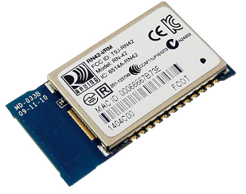
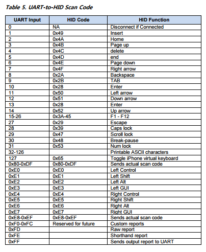
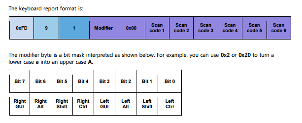

RN-42の使い方メモ
====

* http://www.microchip.com/wwwproducts/en/RN42
* http://akizukidenshi.com/catalog/g/gM-07612/
* http://akizukidenshi.com/catalog/g/gK-07378/
* http://cdn.sparkfun.com/datasheets/Wireless/Bluetooth/RN-HID-User%20Guide-1.1r.pdf

接続
----
RN-42の配線は上記URLを参照。
3.3Vを供給して、TX,RXにFTDIなどのUARTを接続。
デフォルトは115200bps。

CMDモードへの入り方
----
RN-42がBluetoothで何も接続していない状態で、UARTから$$$を3文字入力するとCMDモードに入る。
次に、+[enter]を入力してローカルエコーを有効にする。

CMDモードではRN-42本体の設定を行うことができる。

CMDモードを抜けるときは---[enter]を入力。

キーボードとしてRN-42を使う。
----
CMDモードで以下の内容を入力。

    S~,6[enter]             // HIDデバイス
    SM,6[enter]             // ペアリングモード
    SH,0230[enter]          // combo mode (keyboard + mouse + consumer)
    SN,keyboardtest[enter]  // 機器名をつける
    R,1[enter]              // リセットする

リブート後、PCなどとペアリングを行うと、RN-42をキーボードとして使用することができる。

ターミナルなどからRN-42のUARTに対して文字を入力すると、
対応する文字のスキャンコードが送信される。

* RN-HID-User Guide-1.1r.pdf 13ページより

生scanコードを送信したい場合は、0xFDから始まるデータを送信する。

* RN-HID-User Guide-1.1r.pdf 8ページより

ヘルプ
----
CMDモードでh[enter]を入力するとヘルプが表示される

    *** SET COMMANDS ***
    SA,<3,0>   - Authentication
    SC,<hex>   - Service Class
    SD,<hex>   - Device Class
    SE,<1-16>  - UUID
    SF,1       - Factory Defaults
    SH,<hex>   - HID flags
    SI,<hex>   - Inquiry Scan Window
    SJ,<hex>   - Page Scan Window
    SL,<E,O,N> - Parity
    SM,<0-5>   - Mode (0=slav,1=mstr,2=trig,3=auto,4=DTR,5=Any)
    SN,<name>  - Name
    SO,<text>  - conn/discon Status
    SP,<text>  - Pin Code
    SR,<adr>   - Remote Address
    SS,<text>  - Service Name
    ST,<num>   - Config Timer
    SU,<rate>  - Baudrate
    SW,<hex>   - Sniff Rate
    SX,<1,0>   - Bonding
    SY,<hex>   - TX power
    SZ,<num>   - Raw Baudrate
    S~,<0-6>   - Profile (0=SPP,1=DCE,2=DTE,3=MDM,4=D&S,6=HID
    S?,<0-1>   - role switch
    S$,<char>  - CMD mode char
    S@,<hex>   - io port dir
    S&,<hex>   - io port val
    S%,<hex>   - io boot dir
    S^,<hex>   - io boot val
    S*,<hex>   - pio(8-11) set
    S|,<hex>   - low power timers
    S+,<num>   - DTR timer
    S=,<hex>   - Key mapper
    S:,<num>   - sleep timer
    *** DISPLAY      ***
    D     - Basic Settings
    E     - Extended Settings
    G<X>  - Stored setting
    GB    - BT Address
    GF    - BT Address of Last Connection
    GK    - Connect Status
    G&    - I/O Ports
    V     - Firmare version
    *** OTHER        ***
    C,<adr>    - Connect
    F,1        - Fast Mode
    I,<time>,<cod> - Device Scan Inquiry
    J          - Hide Pin Code
    K,         - Kill (disconnect)
    L,         - toggle local echo
    P,<text>   - Pass Thru
    Q          - Quiet (no discovery)
    R,1        - Reboot
    T,<0,1>    - send data in CMD mode
    U,<rate>,<E,O,N> - Temp Uart Change
    Z          - low power sleep
    &          - Read switches

Copyright and license
----
Copyright (c) 2016 yoggy

Released under the [MIT license](LICENSE.txt)